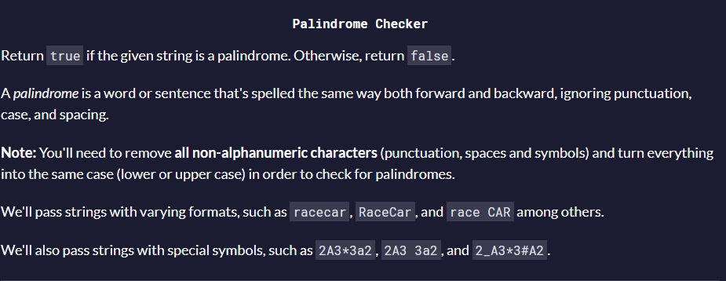

# Palindrome Checker

  

I was using Regular Expression [^A-Za-z0–9] - Which point every non-word within the string. (This is the same as \W).  
Then, I took the word string and using Tolower() and replace() I was taking off every special character including spaces   For example, if I passed "Where-Are You??", my new string will be "whereareyou".   Then, the way of thinking was, that if I have a word with a length of 30, and I double check every for loop iterate, then the actual length is length/2 (15 in 30 case).   The for loop is in charge for the indexing. the if statement is in charge for the boolean result.   If the first character word[0] is the same as the word last index (which is word.length - 1). then, the formula is the increase word[i] everytime and the same time to decrease i from the word[word.length - 1 - i].   If every char is the same as the equivalent then the if statement isn't true, the loop breaks and it return true. 
