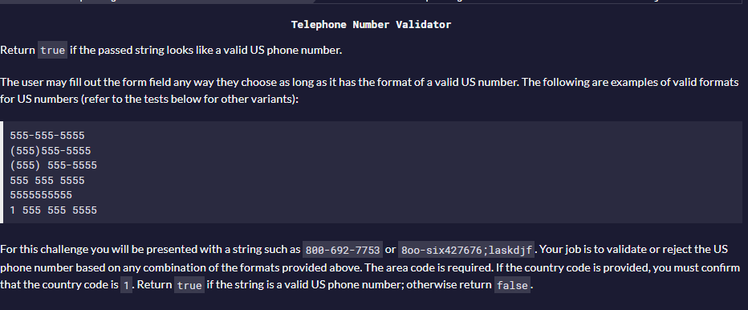

# Telephone Number Validator

This project was pure Regex thinking. I learned alot about regex and the 'OR' operator inside of it, and how it can become useful.  
The regex is ^(1\s?)?((\([0-9]{3}\))|[0-9]{3})[\s\-]?[\0-9]{3}[\s\-]?[0-9]{4}$  
^ - determine the start of a string.  
(1\s?)? - This pattern is handles the starting number, in case the telephone number starts with 1, 1+space or 1(555). the question mark (?) is in charge for not follow the direct pattern and accept changes. for exmaple, (great!?)?123 will accept great 123, great! 123, great123, great!123 and so on..  
((\([0-9]{3}\)) - there is a group inside a group (nested group), that the pattern of \( is in charge to make sure a valid number will be (555) and not 555). Then, it's check for a valid pattern of 3 numbers exactly ({3}) from the range of ([0-9]).  
| - 'OR' Operator, just like Programming langauges operators. This will give validate value to either 555-555-5555 and 1 555-555-5555, and not stick to a strict of 1 555-555-555 or 555-555-5555.  
[\s\-] - is in charge for validate a space and - special characters. 5555555555 and 555-555-5555 and 555 555 5555 is valid the same thanks to this pattern.  
the rest is just the same as the beginning, the only diffrences is {3} the first two groups and {4} for the last group.
